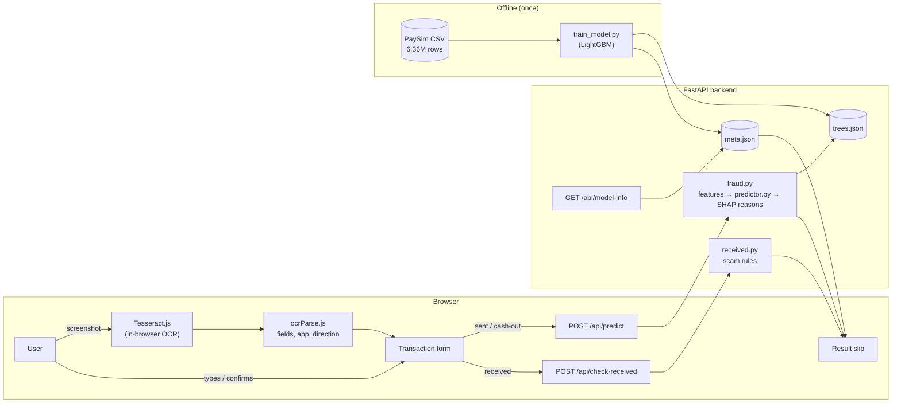
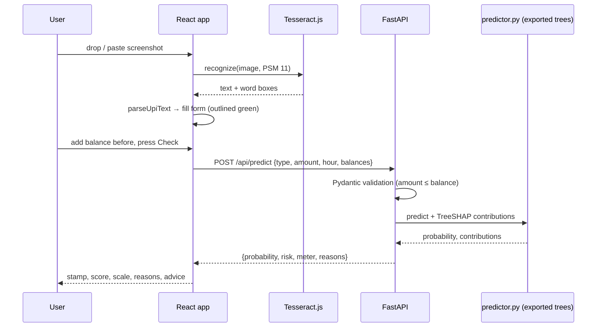
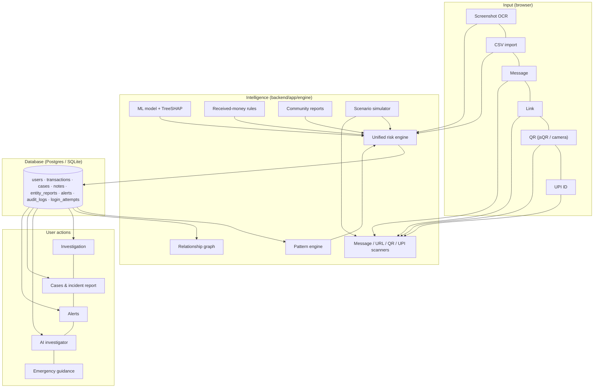
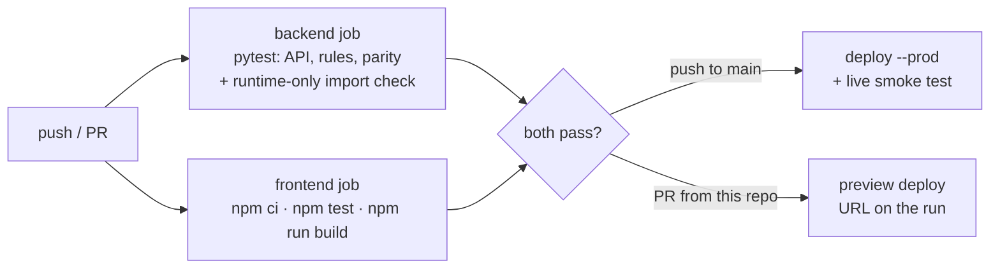

# UPI Guard: Technical Reference Document

| | |
|---|---|
| **Project** | UPI Guard (formerly UPI Fraud Check) |
| **Repository** | <https://github.com/PrathmeshPawar2110/UPI_Fraud_Detection> |
| **Document** | Technical Reference Document (TRD) |
| **Last updated** | 3 October 2026 |
| **Status** | Educational project; runs locally or on Vercel, deployed by GitHub Actions |

This document describes how the system works end to end: the data, the model, the backend API, the frontend, screenshot reading (OCR), and how to run, change and extend it. The [README](../README.md) is the short version. This is the complete one.

**Part I** (§1–§16) covers the original single-payment checker, which UPI Guard keeps unchanged. **Part II** (§17–§28) covers the platform built around it: accounts, history, the pattern and unified risk engines, investigation, scam intelligence, cases, the relationship graph, the simulator and the AI investigator.

---

## Contents

1. [Purpose and scope](#1-purpose-and-scope)
2. [System overview](#2-system-overview)
3. [Technology stack](#3-technology-stack)
4. [Project structure](#4-project-structure)
5. [Data](#5-data)
6. [Machine-learning pipeline](#6-machine-learning-pipeline)
7. [Backend (FastAPI)](#7-backend-fastapi)
8. [Received-money rules](#8-received-money-rules)
9. [Frontend (React)](#9-frontend-react)
10. [Screenshot reading (OCR)](#10-screenshot-reading-ocr)
11. [UI design system](#11-ui-design-system)
12. [Privacy and security](#12-privacy-and-security)
13. [Running, building and configuration](#13-running-building-and-configuration)
14. [Testing and verification](#14-testing-and-verification)
15. [Limitations and known issues](#15-limitations-and-known-issues)
16. [Extending the project](#16-extending-the-project)

**Part II: UPI Guard platform**

17. [Platform architecture and data model](#17-platform-architecture-and-data-model)
18. [Accounts, sessions and access control](#18-accounts-sessions-and-access-control)
19. [Pattern engine](#19-pattern-engine)
20. [Unified risk engine](#20-unified-risk-engine)
21. [Transactions, CSV import and investigation](#21-transactions-csv-import-and-investigation)
22. [Scam intelligence](#22-scam-intelligence)
23. [Cases, evidence, incident reports and alerts](#23-cases-evidence-incident-reports-and-alerts)
24. [Relationship graph](#24-relationship-graph)
25. [Simulator, demo data and live stream](#25-simulator-demo-data-and-live-stream)
26. [AI investigator](#26-ai-investigator)
27. [Frontend application](#27-frontend-application)
28. [API reference](#28-api-reference)

---

## 1. Purpose and scope

**Problem.** UPI users often cannot tell whether a payment is part of a scam: an account takeover that drains their balance, a fake "payment received" screenshot, or a stranger's "wrong transfer" they are then asked to return.

**What the app does.** A user uploads a payment screenshot from Google Pay, PhonePe, Paytm or BHIM (or types the details), confirms a few fields, and gets:

- a risk level (low / medium / high),
- a fraud score (for sent money) or a rule verdict (for received money),
- plain-English reasons, and
- what to do next (1930 helpline, cybercrime.gov.in, contacting the bank).

**Two scoring paths.**

| Payment | Scored by | Why |
|---|---|---|
| Sent money, cash withdrawal | LightGBM model trained on PaySim | PaySim labels outgoing account-takeover fraud |
| Received money | Transparent rules | PaySim has no labelled scams on incoming money |

**UPI Guard adds** (Part II): an account with persistent transaction history, CSV import, history-based pattern detection, a unified risk score that combines all evidence, an investigation workspace, message / link / QR / UPI-ID scanners, community reports, cases with incident reports, alerts, a relationship graph, a fraud simulator with synthetic data, and an opt-in AI investigator that explains the stored evidence.

**Feasibility decisions.** Each feature in the expansion specification (`UPI_GUARD_EXPANSION.txt`) was checked before it was built:

| Specified | Decision | Reason |
|---|---|---|
| History, patterns, unified risk, investigation, scanners, cases, reports, alerts, graph, simulator, settings, learn, emergency | Built | Deterministic, testable, and deployable on Vercel |
| Database | Postgres in production, SQLite locally and in tests | Vercel's filesystem is read-only except `/tmp`, which is wiped on cold start |
| AI investigator | Built, opt-in, with a choice of Anthropic, OpenAI, Azure OpenAI or Google Gemini | Needs an API key and consent, because data leaves the server |
| Real-time stream | Browser timer calling the API | Vercel functions can't hold long-lived SSE or WebSocket connections |
| QR scanning | jsQR in the browser, camera over HTTPS | The BarcodeDetector API isn't supported in every browser |
| URL redirect following | Not done | Fetching user-supplied URLs from the server is a server-side request forgery risk |
| Shared community reports | Built, aggregate counts only | Unverified reports must not expose reporters or label people publicly |
| Bank PDF statement import | Not built | There's no standard format; CSV import covers the need |
| Hindi or Marathi OCR | Not built | Large language data; the text scanner covers Hinglish and common Devanagari words |
| Voice analysis, federated learning, real Account Aggregator | Not built (future work) | Research or regulated features; Settings shows a clearly labelled AA simulation |

**Out of scope.** Real payments, real account freezing, real bank or NPCI integration, collecting bank credentials, and official-looking alerts. No public dataset of labelled real UPI fraud exists, so the model is trained on a synthetic analogue ([§5](#5-data)).

---

## 2. System overview



**Request flow for a sent payment:**



Training happens once, offline, with LightGBM. The trained model is committed, so running the app needs neither the dataset nor training. At runtime the API does not use LightGBM: it scores the exported trees in pure Python (`predictor.py`), with identical results ([§7.3](#73-scoring-flow-fraudpy)).

**UPI Guard platform (Part II):**



---

## 3. Technology stack

Versions are those installed and verified on 3 Oct 2026. Ranges in the requirement files allow newer minor versions.

### Frontend

| Technology | Version | Used for |
|---|---|---|
| React | 19.3.0 (`^19.0.0`) | UI components and state |
| React DOM | 19.3.0 | Rendering |
| Vite | 7.3.6 (`^7.0.0`) | Dev server (port 5173), `/api` proxy, production build |
| @vitejs/plugin-react | 5.2.0 | JSX transform, fast refresh |
| Tesseract.js | 5.1.1 | OCR in the browser (WebAssembly build of Tesseract) |
| Node.js | 20.19+ or 22.12+ required by Vite 7 (verified on 24.21.0) | Tooling only |
| Google Fonts | Instrument Serif, IBM Plex Sans, IBM Plex Mono | Typography |
| react-router | 7.18.4 (`^7.18.4`) | Client-side routes (Part II pages) |
| jsQR | 1.4.0 (Apache-2.0) | QR decoding in the browser (lazy-loaded chunk) |
| d3-force | 3.0.0 (ISC) | Force layout for the relationship graph (rendered as plain SVG) |

No UI framework, CSS framework or state library is used: plain React state and context, and two hand-written stylesheets (`styles.css`, `platform.css`).

### Backend

| Technology | Version | Used for |
|---|---|---|
| Python | 3.10+ (verified on 3.14.7) | Runtime |
| FastAPI | 0.142.2 (`>=0.115`) | HTTP API, validation errors, static file serving |
| Pydantic | 2.13.5 | Request/response models and validation |
| Uvicorn (`[standard]`) | 0.54.0 (`>=0.30`) | ASGI server for local runs, auto-reload in development |
| `predictor.py` (own code) | | Pure-Python tree inference and TreeSHAP for the exported model; no LightGBM, NumPy or SciPy at runtime |
| SQLAlchemy | 2.1.3 (`>=2.0`) | ORM and database engine (Postgres in production, SQLite locally) |
| psycopg (binary) | 3.3.6 (`>=3.2`) | Postgres driver |
| anthropic | 1.11.0 (`>=0.40`) | AI investigator: Anthropic provider |
| openai | 3.24.0 (`>=1.50`) | AI investigator: OpenAI, Azure OpenAI (`AzureOpenAI` client) and Gemini (OpenAI-compatible endpoint) |
| python-dotenv | (`>=1.0`, local only) | Loads `backend/.env` in development |
| Standard library | `hashlib.scrypt`, `hmac` | Password hashing and signed session cookies (no auth dependency) |

The deployed function's packages (root `requirements.txt`) unpack to about 56 MB, well within Vercel's limit.

### Testing, CI/CD and hosting

| Technology | Version | Used for |
|---|---|---|
| pytest | `>=8` | Backend tests |
| httpx | `>=0.27` | FastAPI `TestClient` |
| LightGBM, NumPy | 4.7.0, 2.5.3 | Test-only reference for predictor parity |
| Node.js test runner | built in (`node --test`) | OCR parser tests |
| GitHub Actions | `ubuntu-latest`, Python 3.12, Node 22 | CI (tests, build) and CD (deploy) |
| Vercel | CLI `latest` | Hosting: static frontend plus one Python serverless function |

### Training (offline)

| Technology | Version | Used for |
|---|---|---|
| pandas | 3.0.6 (`>=2.2`) | Loading the 470 MB CSV, filtering, features |
| NumPy | `>=1.26` | Metrics (implemented by hand, see below) |
| LightGBM | `>=4.3` | Gradient-boosted trees |

scikit-learn is deliberately not used. On the development machine, Windows Application Control blocks one of SciPy's DLLs, so PR-AUC, ROC-AUC and the threshold searches are implemented in NumPy in `train_model.py`.

---

## 4. Project structure

```
UPI_Fraud_Detection/
├── README.md                     quick start, API summary, results
├── data-and-scope.md             dataset comparison and why PaySim was chosen
├── docs/
│   └── TRD.md                    this document
├── requirements.txt              deployed API dependencies (FastAPI only), installed by Vercel
├── requirements-train.txt        training dependencies (pandas, numpy, lightgbm)
├── train_model.py                data filtering, features, training, evaluation, export
├── Dataset/                      PaySim CSV goes here (git-ignored, ~470 MB)
├── vercel.json                   Vercel build, function and rewrite settings
├── .vercelignore                 files kept out of Vercel uploads
├── .github/
│   └── workflows/
│       └── ci-cd.yml             tests on every push / PR, then deploy to Vercel
├── api/
│   └── index.py                  Vercel serverless entry point (imports backend/app)
│
├── backend/
│   ├── requirements.txt          local API dependencies (FastAPI, uvicorn, SQLAlchemy, psycopg, anthropic)
│   ├── requirements-dev.txt      + pytest, httpx, lightgbm, numpy for tests
│   ├── pytest.ini                test paths
│   ├── app/
│   │   ├── main.py               FastAPI app: original endpoints, routers, headers, CSP, size limit, SPA fallback
│   │   ├── config.py             settings from environment variables
│   │   ├── db.py                 SQLAlchemy engine/sessions (Postgres or SQLite), init_db
│   │   ├── models.py             ORM tables (§17)
│   │   ├── auth.py               scrypt passwords, signed session cookies, login throttle, /api/auth
│   │   ├── services.py           shared per-user operations: history, scoring, alerts, related, rescoring
│   │   ├── llm.py                AI providers (Anthropic, OpenAI, Azure OpenAI, Gemini), selection, tool loops
│   │   ├── schemas.py            original Pydantic models: Transaction, ReceivedPayment, Prediction
│   │   ├── fraud.py              feature row, scoring, SHAP → reasons, risk bands, fast predict
│   │   ├── predictor.py          pure-Python tree inference + TreeSHAP (port of LightGBM's)
│   │   ├── received.py           rule-based check for received money
│   │   ├── engine/
│   │   │   ├── patterns.py       history pattern detectors (§19)
│   │   │   ├── risk.py           unified risk engine (§20)
│   │   │   ├── csv_import.py     CSV parsing with flexible columns and dates
│   │   │   ├── message.py        SMS / WhatsApp scam scanner
│   │   │   ├── urls.py           link heuristics (never fetches)
│   │   │   ├── qr.py             UPI QR / deep-link analysis
│   │   │   ├── upi.py            UPI ID validation, handle → app/bank, lure words
│   │   │   ├── graph.py          relationship graph, fan-in/out, cycles, clusters
│   │   │   ├── simulator.py      9 scam scenarios, synthetic baseline, demo dataset, live stream
│   │   │   ├── guidance.py       emergency steps and official resources
│   │   │   └── redact.py         masks OTPs, PINs, CVVs and card numbers
│   │   ├── routes/
│   │   │   ├── common.py         TransactionIn / Out schemas, ownership check
│   │   │   ├── transactions.py   history, import, review, investigation, notes
│   │   │   ├── intel.py          scanners, UPI check, community reports
│   │   │   ├── cases.py          cases, evidence, notes, incident report
│   │   │   ├── alerts.py         alerts and guidance
│   │   │   ├── network.py        graph endpoints
│   │   │   ├── simulator.py      scenarios, demo data, live stream
│   │   │   ├── ai.py             AI investigator (tools, citation check, route)
│   │   │   └── account.py        settings, export, deletion, retention, model monitoring
│   │   └── model/
│   │       ├── trees.json        exported trees, served by the API (~0.35 MB)
│   │       ├── fraud_model.txt   trained LightGBM model (reference for tests, ~0.5 MB)
│   │       └── meta.json         features, thresholds, split, metrics, sample transactions
│   └── tests/
│       ├── conftest.py           temporary SQLite database, signed-in user fixtures
│       ├── test_api.py           original endpoints, rules, validation, Vercel entry point
│       ├── test_predictor.py     predictor == LightGBM (probabilities and SHAP)
│       ├── test_engine.py        pattern detectors and unified risk properties
│       ├── test_scanners.py      message / URL / QR / UPI scanners, redaction
│       ├── test_platform.py      auth, transactions, import, access control, cases, reports, graph, security
│       └── test_ai.py            AI investigator: provider selection, all providers with fake clients
│
└── frontend/
    ├── index.html                page shell, fonts, favicon
    ├── package.json              scripts: dev, dev:network, build, preview, test
    ├── vite.config.js            port 5173, proxies /api → 127.0.0.1:8000
    └── src/
        ├── main.jsx              routes (react-router), auth provider
        ├── styles.css            design tokens, light/dark themes, checker styles
        ├── platform.css          styles for the platform pages (§27)
        ├── pages/                Home, Check, Login, Transactions, Investigate, Scan, Network,
        │                         Simulator, Alerts, Cases (+ report), Reports, Learn, Emergency,
        │                         Settings, Info (privacy, model, 404)
        ├── components/
        │   ├── Layout.jsx        top bar, navigation, alert badge, footer
        │   ├── ui.jsx            Level, Stamp, Synthetic, TxRow, Breakdown, Reasons, Tabs, …
        │   ├── AiPanel.jsx       AI investigator panel with citation links
        │   ├── Graph.jsx         force-layout SVG graph with pan / zoom / select
        │   ├── QrScanner.jsx     QR from image or camera (jsQR)
        │   ├── UploadCard.jsx    screenshot drop / choose / paste, runs OCR
        │   ├── TransactionForm.jsx payment type, fields, received-money questions
        │   ├── ResultCard.jsx    result slip (stamp, score, scale, reasons, advice)
        │   └── ModelInfo.jsx     "About the model": training summary and test metrics
        └── lib/
            ├── ocrParse.js       OCR text + word boxes → payment fields
            ├── ocrParse.test.js  parser tests (made-up receipts per app)
            ├── api.js            fetch helpers for every endpoint
            ├── auth.jsx          session context, RequireAuth
            └── format.js         ₹ formatting, dates, download helper
```

Git-ignored: `Dataset/`, `*.csv`, virtual environments, `node_modules/`, `frontend/dist/`, `.vercel/`, `.env*`, editor folders, local `backend/*.db`.

---

## 5. Data

### 5.1 Source

**PaySim** ([Kaggle: ealaxi/paysim1](https://www.kaggle.com/datasets/ealaxi/paysim1), CC BY-SA 4.0) is a synthetic mobile-money simulator calibrated on real transaction logs from an African mobile-money service. The Kaggle file is a quarter-scale copy of the original simulation: 6,362,620 rows over 744 hourly steps (30 days). [data-and-scope.md](../data-and-scope.md) compares it with the alternatives (credit-card ULB data, a small UPI dataset) and explains the choice.

Columns used: `step` (hour of simulation), `type`, `amount`, `oldbalanceOrg`, `newbalanceOrig`, `oldbalanceDest`, `newbalanceDest`, `isFraud`, `isFlaggedFraud`. Account IDs (`nameOrig`, `nameDest`) are dropped.

**Fraud in PaySim** is account takeover: a fraudster takes over an account, transfers the balance to another account (`TRANSFER`) and withdraws it (`CASH_OUT`).

### 5.2 Filtering

| Stage | Rows | Frauds | Reason |
|---|---|---|---|
| Full dataset | 6,362,620 | 8,213 | |
| `CASH_IN`, `PAYMENT`, `DEBIT` removed | −3,592,211 | 0 | These types contain no fraud at all |
| `TRANSFER` + `CASH_OUT` | 2,770,409 | 8,213 | |
| Realistic-rows filter | **281,759** | **8,168** (99.5%) | See below |

**Realistic-rows filter:** `oldbalanceOrg > 0` **and** `amount ≤ oldbalanceOrg + 1`. It removes 2,488,650 rows, which hold only 45 frauds (41 of them have a zero sender balance).

Why it exists: in about 90% of legitimate PaySim transfers, the amount exceeds the sender's balance and the balances do not add up. That is a bookkeeping artefact of the simulator, while 99.5% of frauds add up exactly. A model trained on all rows learns "balances add up → fraud", which would flag every real user, because real balances always add up. The filter keeps only transactions a real user could enter. The API enforces the same rule (amount ≤ balance), so the model never sees inputs outside its training domain. After filtering, `errorBalanceOrig` is about 0 everywhere, so it is not used.

### 5.3 Time-based split

Splitting by time (not randomly) tests the model on transactions that happen after everything it learned from.

| Split | Steps | Rows | Frauds |
|---|---|---|---|
| Train | 1–400 | 251,957 | 4,444 |
| Validation | 401–550 | 18,379 | 1,586 |
| Test | 551–743 | 11,423 | 2,138 |

Validation is used for early stopping and for choosing thresholds. The test set is touched only once, for the final metrics.

---

## 6. Machine-learning pipeline

Everything in this section is in [train_model.py](../train_model.py). It runs in about 2 minutes: `python train_model.py`.

### 6.1 Features

The same logic exists twice: vectorised in `train_model.build_features` and for one row in `backend/app/fraud.build_row`. **They must stay identical.**

| Feature | Definition | Notes |
|---|---|---|
| `is_transfer` | 1 if `TRANSFER`, 0 if `CASH_OUT` | |
| `amount` | transaction amount | |
| `hour` | `step % 24` | In the app: the hour of the payment's date/time |
| `oldbalanceOrg` | sender balance before | |
| `newbalanceOrig` | sender balance after | App default: `max(before − amount, 0)` |
| `amount_to_balance` | `amount / (oldbalanceOrg + 1)` | Share of the balance sent |
| `drains_account` | 1 if `newbalanceOrig == 0` and `oldbalanceOrg > 0` | Account emptied |
| `oldbalanceDest` | receiver balance before | Optional, NaN when unknown |
| `newbalanceDest` | receiver balance after | Optional, NaN when unknown |
| `errorBalanceDest` | `oldbalanceDest + amount − newbalanceDest` | Money that "vanished" at the receiver |

**Receiver balances are optional.** A real user rarely knows the receiver's balance, so the three receiver features are set to NaN for a random 50% of training rows and 50% of validation rows (`MASK_RATE = 0.5`, seed 42). LightGBM handles missing values natively, so one model scores well with or without them.

### 6.2 Model and training

LightGBM binary classifier:

| Parameter | Value | Why |
|---|---|---|
| `objective` | `binary` | fraud / not fraud |
| `learning_rate` | 0.05 | |
| `num_leaves` | 31 | |
| `min_child_samples` | 200 | Regularisation: avoids tiny leaves on a near-separable problem |
| `lambda_l2` | 10.0 | Regularisation |
| `feature_fraction` | 0.9 | |
| `bagging_fraction` / `bagging_freq` | 0.8 / 1 | |
| `metric` | `binary_logloss` | Average precision hits 1.0 after one tree, so early stopping uses log-loss |
| `monotone_constraints` | `newbalanceOrig: −1`, `amount_to_balance: +1`, `drains_account: +1` | Sending a larger share, or leaving less behind, can never lower the score |
| `num_boost_round` | up to 500, early stopping after 50 rounds without improvement | Best iteration: **487** |
| `seed` | 42 | |

The monotone constraints make the model's behaviour explainable and safe against odd edge cases. For example, it cannot learn that emptying the account is *less* risky in some corner of the data.

### 6.3 Thresholds

Both thresholds are chosen on the validation set only:

| Band | Threshold | Rule |
|---|---|---|
| High risk | probability ≥ **0.2778** | Threshold with the best F1 on validation |
| Medium risk | probability ≥ **0.0695** | Lowest threshold that still reaches 99.5% recall on validation (falls back to high ÷ 4 if that would not be below high) |
| Low risk | below 0.0695 | |

### 6.4 Metrics

Implemented in NumPy: average precision (PR-AUC), rank-based ROC-AUC, precision/recall/F1 at a threshold, recall at 90% precision, and best-F1 / target-recall threshold search. PR-AUC is the primary metric because fraud is rare.

**Test set** (11,423 later transactions, 2,138 frauds), at the high-risk threshold:

| | PR-AUC | ROC-AUC | Recall | Precision | Confusion (TN / FP / FN / TP) |
|---|---|---|---|---|---|
| Model, receiver balances known | 1.000 | 1.000 | 99.9% | 100% | 9,285 / 0 / 2 / 2,136 |
| Model, receiver balances unknown | 1.000 | 1.000 | 99.5% | 100% | 9,285 / 0 / 10 / 2,128 |
| Rule: simulator's `isFlaggedFraud` | 0.206 | | 0.5% | 100% | |
| Rule: amount > 2,00,000 | 0.469 | | 67.4% | 58.9% | |
| Rule: sends entire balance | 0.980 | | 97.1% | 100% | |

**Feature importance (gain):** `newbalanceOrig` 82.1%, `drains_account` 12.9%, `amount` 2.5%, `amount_to_balance` 1.8%, `oldbalanceOrg` 0.4%, the rest below 0.1% each.

**How to read these numbers.** PaySim is close to separable: among realistic rows, no legitimate transaction empties the sender's account, while 98% of frauds do. The one-line rule "sends entire balance" already reaches PR-AUC 0.98. Real UPI fraud is much more varied (social engineering where the victim pays the scammer, collect-request scams, QR swaps, partial transfers), so real-world performance would be far lower. Because of the near-separation, scores cluster near 0 or 1 and the medium band is rare.

### 6.5 Artifacts

`train_model.py` writes three files to `backend/app/model/`:

- **`fraud_model.txt`**: the LightGBM booster at its best iteration, in LightGBM's text format. It isn't used at runtime: it's the reference the parity tests compare against.
- **`trees.json`**: the same trees exported by `export_trees` from `model.dump_model()`, in compact JSON (~0.35 MB) that the API serves. Internal node: `f` feature index, `t` threshold, `m` missing type (0 none, 1 zero, 2 NaN), `d` default-left, `c` training-data count, `l` / `r` children. Leaf: `v` value, `c` count. The export asserts a binary objective and numerical (`<=`) splits only.
- **`meta.json`**:

| Key | Content |
|---|---|
| `dataset` | Description of the training data and filters |
| `rows_before_filter`, `frauds_before_filter` | 2,770,409 and 8,213 (`TRANSFER` + `CASH_OUT`) |
| `features` | Ordered feature list, which the backend uses to build the input vector |
| `split` | Step ranges, row and fraud counts per split |
| `thresholds` | `{high, medium}` |
| `best_iteration` | 487 |
| `metrics_test` | Model (with / without receiver balances) and the three baselines |
| `feature_importance` | `[feature, share]` pairs, sorted |
| `samples` | 5 legit (score < medium) and 5 fraud (score ≥ high) test transactions for the "Or try" buttons |

---

## 7. Backend (FastAPI)

### 7.1 Endpoints

| Method | Path | Request | Response |
|---|---|---|---|
| `POST` | `/api/predict` | `Transaction` | `Prediction` (model) |
| `POST` | `/api/check-received` | `ReceivedPayment` | `Prediction` (rules) |
| `GET` | `/api/model-info` | | `dataset`, `split`, `thresholds`, `metrics_test`, `feature_importance`, `samples` from `meta.json` |
| `GET` | `/docs` | | Interactive OpenAPI docs (FastAPI built-in) |
| `GET` | `/*` | | The built React app from `frontend/dist`, when it exists |

### 7.2 Schemas ([schemas.py](../backend/app/schemas.py))

**`Transaction`** (sent money / cash withdrawal):

| Field | Type | Constraint |
|---|---|---|
| `type` | `"TRANSFER"` \| `"CASH_OUT"` | required |
| `amount` | float | > 0, finite |
| `hour` | int | 0–23 |
| `sender_balance_before` | float | ≥ 0, finite |
| `sender_balance_after` | float \| null | ≥ 0; defaults to `max(before − amount, 0)` |
| `receiver_balance_before` | float \| null | ≥ 0 |
| `receiver_balance_after` | float \| null | ≥ 0 |

Model validator: `amount ≤ sender_balance_before + 1`. A UPI payment cannot exceed the balance, and it keeps inputs inside the training domain ([§5.2](#52-filtering)).

**`ReceivedPayment`**: `amount` (> 0), `hour` (0–23), `knows_sender`, `in_bank`, `asked_to_pay`, each `"yes"` \| `"no"` \| `"unsure"`.

**`Prediction`**:

| Field | Type | Meaning |
|---|---|---|
| `probability` | float \| null | Model probability of fraud; `null` for the rules path |
| `risk` | `"low"` \| `"medium"` \| `"high"` | Risk band |
| `meter` | float 0–1 | Marker position on the 3-band scale |
| `reasons` | `[{text, direction: "up"\|"down"}]` | Up to 4 plain-English reasons |
| `used_receiver_balances` | bool | Whether both receiver balances were given |
| `method` | `"model"` \| `"rules"` | Which path scored it |

### 7.3 Scoring flow ([fraud.py](../backend/app/fraud.py))

1. **Load once at import:** the trees from `trees.json` into a `predictor.Model` (~0.25 s), and `features` and `thresholds` from `meta.json`. An assertion checks that both files list the same features.
2. **`build_row`:** turns a `Transaction` into the feature dict in [§6.1](#61-features). Receiver features are used only when **both** receiver balances are given, otherwise NaN.
3. **Predict:** `MODEL.predict(x)` gives the probability.
4. **Explain:** `MODEL.contributions(x)` gives per-feature SHAP contributions in log-odds, identical to LightGBM's `pred_contrib=True` ([§7.5](#75-runtime-predictor-predictorpy)). They are summed into five groups:

   | Group | Features |
   |---|---|
   | balance | `oldbalanceOrg`, `newbalanceOrig`, `amount_to_balance`, `drains_account` |
   | amount | `amount` |
   | time | `hour` |
   | type | `is_transfer` |
   | receiver | the three receiver features (skipped when unknown) |

   Each group becomes a sentence whose wording depends on the values and on the sign of the contribution (for example, "It sends the entire balance (₹2,00,483) and leaves the account at ₹0…"). Groups with |contribution| ≥ 0.1 are kept, sorted by size, at most 4. If none reach 0.1, the top 2 are shown.
5. **Band:** high if p ≥ 0.2778, medium if p ≥ 0.0695, else low.
6. **Meter:** each band takes a third of the scale, and p is placed linearly inside its band, so the marker is readable even though scores cluster near 0 and 1.

Amounts in reasons use Indian digit grouping (`₹12,34,567`).

### 7.4 Errors, CORS and serving

- **Validation errors** (HTTP 400 instead of FastAPI's default 422) are turned into one readable message, `{"detail": "Amount: input should be greater than 0."}`, using a field-label map. The frontend shows `detail` as is.
- **CORS** allows `http://localhost:5173` and `http://127.0.0.1:5173`. In development the Vite proxy makes calls same-origin anyway.
- **Single-server mode:** if `frontend/dist` exists, FastAPI mounts it at `/` with `html=True`, so `uvicorn` alone serves both the UI and the API.
- **On Vercel** the frontend and API share one domain, so CORS isn't involved. The function bundle doesn't include `frontend/dist`, so the mount is skipped there.

### 7.5 Runtime predictor ([predictor.py](../backend/app/predictor.py))

**Why it exists.** Running LightGBM in the deployed function would need LightGBM, NumPy and SciPy (~190 MB unpacked, close to Vercel's Python function limit) and the system OpenMP library `libgomp`, which LightGBM's Linux build links against but doesn't bundle. A tree ensemble is simple to evaluate, so the API runs the exported trees in pure Python. The deployed function then needs only FastAPI (~25 MB of packages).

**What it implements**, ported line for line from LightGBM's C++ (`tree.h`, `tree.cpp`):

| Function | LightGBM original | Role |
|---|---|---|
| `_goes_left` | `NumericalDecision` | Split rule with missing values: NaN is treated as 0 unless the split's missing type is NaN; NaN (or zero, for missing type Zero) follows the default direction; otherwise `value <= threshold` goes left |
| `Model.raw` / `predict` | `Predict` | Sum of the reached leaf values; probability = 1 / (1 + e^(−raw)) (objective `binary sigmoid:1`) |
| `_expected_value` | `ExpectedValue` | Leaf values averaged by training counts; summed over trees, this is the SHAP base value |
| `_tree_shap`, `_extend`, `_unwind`, `_unwound_sum` | `TreeSHAP`, `ExtendPath`, `UnwindPath`, `UnwoundPathSum` | Exact TreeSHAP (Lundberg et al., 2018), with node training counts as cover |

**Guarantees.** `tests/test_predictor.py` compares it with LightGBM on 320 rows (the 10 sample transactions with and without receiver balances, plus 300 random rows with zero balances, emptied accounts and NaN receiver balances):
- probabilities agree to 1e-12,
- SHAP contributions agree to 1e-9,
- contributions sum to the raw score.

**Cost.** About 30 ms per request for 487 trees (prediction plus SHAP) and about 0.25 s to load, measured on the development laptop.

---

## 8. Received-money rules

[received.py](../backend/app/received.py). The model cannot score incoming money, so these rules target the common Indian scams that start with money arriving, or seeming to arrive:

| Scam | Signal used |
|---|---|
| Fake "payment received" screenshot (goods or refund taken, no money ever arrived) | `in_bank = no` |
| "Sent by mistake, please return it" (the credit is stolen or later reversed) | `asked_to_pay = yes` |
| Task / job / investment scam (small payout first, then "pay a deposit") | `asked_to_pay = yes` |
| Money-mule laundering (stolen money routed through your account, which then gets frozen) | `knows_sender = no`, especially with large amounts |

**Rules:** the risk starts at low and each rule can only raise it.

| Condition | Raises risk to |
|---|---|
| `in_bank = no` | high |
| `asked_to_pay = yes` | high |
| `knows_sender = no` and amount ≥ ₹50,000 | high |
| `knows_sender = no` or `unsure` | medium |
| `in_bank = unsure` | medium |
| otherwise | low |

A night-time note (hour 0–5) is added as a reason when the sender isn't known, but it doesn't change the band. Reasons are ranked by weight and capped at 4. The response has `probability: null`, `method: "rules"`, and a fixed meter position per band (1/6, 1/2, 5/6).

**Design choice:** receiving money cannot by itself take money out of the account, so an unexpected credit is "medium" (worth care), and "high" needs a stronger sign. This matches the brief: received payments from strangers are suspicious, but less threatening than outgoing fraud.

---

## 9. Frontend (React)

### 9.1 Component tree and state

```
App                         all state lives here
├── header.masthead         title, "Or try" sample links
├── main
│   ├── UploadCard          01: screenshot → OCR → onParsed(fields)
│   └── TransactionForm     02: controlled form (fully driven by App state)
├── aside
│   └── ResultCard          03: result slip, sticky on desktop
├── ModelInfo               training summary and metrics table from /api/model-info
└── footer                  disclaimer, 1930 helpline
```

State in `App.jsx`:

| State | Purpose |
|---|---|
| `form` | All field values: `type`, `amount`, `when`, `balBefore`, `balAfter`, `destBefore`, `destAfter`, `txnId`, `payee`, `payeeUpi`, `status`, `knowsSender`, `inBank`, `askedToPay` |
| `filled` | Set of field names filled by OCR (outlined green; cleared when the user edits that field) |
| `destOpen`, `refOpen` | Whether the optional sections are expanded |
| `busy`, `error` | Request in flight; validation or API error message |
| `result` | Last API response plus `checkedAt`, `received` and reference fields |
| `modelInfo` | `/api/model-info`, used by "About the model" and the sample buttons |

### 9.2 Main flows

**Screenshot → form (`applyParsed`):**
- `direction = received` sets the type to "Received money". `sent` sets "Sent money", unless the user already chose "Cash withdrawal".
- It fills `amount`, `when` (parsed date, or today, plus the parsed time, default 12:00), `txnId`, `payee`, `payeeUpi` and `status`, and marks them as filled.
- It returns `{found, missing}` for the status chips. For sent money, "Balance before" is always missing and gets focus. For received money, "3 quick questions" are missing.

**Submit (`check`):**
- Common checks: amount > 0, date/time present. The hour is taken from the `datetime-local` value.
- Sent / cash-out: balance before required, both or neither receiver balances, then `POST /api/predict`.
- Received: all three questions answered, then `POST /api/check-received`.
- The result is shown in the slip. On narrow screens (< 900 px) the slip scrolls into view.

**Sample buttons:** these pick a random one of the 5 legit or 5 fraud test transactions from `meta.json`, give it a random minute in its hour, fill the form (including receiver balances) and submit immediately.

### 9.3 Form behaviour

- "Sent money / Cash withdrawal / Received money" is a radio group styled as a segmented control (3 columns, stacked below 560 px).
- Sent and cash-out show sender balances (before is required, after is optional with a live hint "Will use ₹… (balance before − amount)"), plus the optional receiver-balance section.
- Received money hides the balances and shows three Yes / No / Not sure questions, with a note that received money is checked with rules rather than the model.
- "Reference details" (transaction ID, name, UPI ID, status) are kept for the user's record and never scored. Their labels switch between "Paid to / Receiver's UPI ID" and "Received from / Sender's UPI ID".

### 9.4 Result slip

- **Header:** "03 · Risk check" and the time of the check, or "Awaiting details".
- **Verdict:** a stamp ("Low / Medium / High risk") in the band colour, a serif headline, and an explanation. The wording differs for received money.
- **Score:** "Fraud score NN.N%" for the model (2 decimals below 1%), or "Checked with: Scam rules".
- **Scale:** three bands, with the active band coloured and a ▼ marker at `meter`.
- **Reasons:** ▲ raises risk, ▼ lowers risk. Screen readers hear "Raises risk:" / "Lowers risk:".
- **Advice** for medium and high: separate lists for sent money (block UPI, call 1930, cybercrime.gov.in, never share the PIN) and received money (don't return money yourself, never enter the PIN to receive, wait for the bank credit, tell the bank).
- **Reference lines** with dotted leaders: transaction ID, name, UPI ID, status, receiver-balance usage.

---

## 10. Screenshot reading (OCR)

### 10.1 Pipeline ([UploadCard.jsx](../frontend/src/components/UploadCard.jsx))

1. **Input:** drag and drop, file picker, or paste (Ctrl+V anywhere on the page, via a document-level `paste` listener). A preview uses an object URL, which is revoked on change or unmount.
2. **Lazy load:** `tesseract.js` is dynamically imported, so it isn't in the main bundle.
3. **OCR:** `createWorker("eng")` with `tessedit_pageseg_mode = PSM.SPARSE_TEXT` (11). Progress drives the bar.
4. **Output:** `data.text` and `data.words` (each word's text and bounding-box height) go to `parseUpiText(text, words)`.
5. The worker is terminated after each image.

**Why sparse-text mode:** with the default page segmentation, Tesseract dropped the large headline amount on all four test receipts (coloured or dark backgrounds, very large type). Sparse mode finds isolated text blocks, recovered every amount, and kept the label structure.

### 10.2 Parser ([ocrParse.js](../frontend/src/lib/ocrParse.js))

Output: `{app, direction, amount, txnId, payee, payeeUpi, status, date, time}`. Every field may be `null`, and anything missing is left for the user.

| Field | Method |
|---|---|
| `app` | Keyword in this order: BHIM, PhonePe, Google Pay ("Google Pay", "Google transaction", "G Pay"), Paytm. BHIM is checked first because its receipts can contain "paytm" inside UPI IDs |
| `direction` | **received:** "Money received", "Received from", "Credited to", "You received", or a line starting "From Name" (no colon, which is GPay's received heading). **sent:** "Money sent", "Paid to", "Sent to", "Debited", "Paid", or a line starting "To …". Received is checked first |
| `amount` | (1) **Tallest amount-shaped word**: matches `[₹ misread]? digits[,grouping][.dd]`, allowing a leading `Z I % & ? ¥ F` (common ₹ misreads). It is accepted only if its height is ≥ 1.25 × the median word height. (2) **Amount in words** ("Rupees Three Hundred Sixty Nine Only", Paytm), parsed with hundred / thousand / lakh / crore, and preferred when the two disagree. (3) Text patterns after `₹ / Rs / INR` or "amount / debited / credited". (4) A short number standing alone on two lines (PhonePe shows the amount twice) |
| `txnId` | Priority: the number after "UTR / RRN / UPI Ref No / UPI transaction ID", then any 12-digit number, then the app's own "Transaction ID / Order ID". The 12-digit UTR is the reference banks and cybercrime.gov.in ask for |
| `payee` | The other party. **Received:** the name after "Received from" or "From". **Sent:** after "Paid to", "Sent to", "To", "Banking Name" or "Payment received by". It takes the first plausible name on the label's line or the next 3 lines, after removing brackets and non-letters, dropping 1-letter fragments, and rejecting label words |
| `payeeUpi` | The first `handle@psp` after that name's label (`.com/.in/.org/.net` emails excluded). A masked prefix (`*`, `+`, `•`, `~`) is shown as `••••` plus the visible part |
| `status` | Failed / Pending / Successful from keywords ("received" and "credited" count as successful) |
| `date` | `16 Jul 2026`, `13 Sept 2026`, `1st Oct 26` (ordinal, 2-digit year → 20xx), `Oct 3, 2026`, and day-first `03/10/2026` / `03-10-26` |
| `time` | `05:15 PM`, `12:25am`, `22:45`; 12 AM → 0, PM adds 12 |

### 10.3 Verified receipts

Tested end to end in the running app (upload → OCR → form → result) with headless Microsoft Edge:

| Receipt | App | Direction | Amount | Other party | Reference | Date and time |
|---|---|---|---|---|---|---|
| Paytm "Money Received" | Paytm | received | ₹369 | Mansuri Alfej Aminbhai, ••••0259@ptsbi | 619776821616 | 16 Jul 2026 17:15 |
| PhonePe "Received from" (dark) | PhonePe | received | ₹300 | Girish Kumbhar | 480477957831 (UTR) | 13 Sep 2026 23:09 |
| Google Pay sent (dark) | Google Pay | sent | ₹20 | Ishita Sharma, ••••a226@okicici | 662276817283 | 13 Sep 2026 20:28 |
| BHIM "Paid" (dark) | BHIM | sent | ₹2,824.92 | JIO Postpaid, ••••53817591@ptybl | 002554331387 | 1 Oct 2026 00:25 |

Every field was correct on all four. Untested layouts include PhonePe and Paytm *sent* receipts, Google Pay and BHIM *received* receipts, and bank apps. The wording for these is coded but not checked against real images.

---

## 11. UI design system

The look is "paper and ink", modelled on bank receipts and ledgers rather than generic dashboard cards.

**Tokens** (CSS custom properties on `:root`, redefined under `prefers-color-scheme: dark`):

| Token | Light | Dark | Use |
|---|---|---|---|
| `--bg` | `#f3f0e8` | `#161512` | Page (warm paper / warm charcoal) |
| `--surface` | `#fbfaf6` | `#1e1c18` | Inputs, result slip |
| `--ink` | `#1d1b17` | `#ece7dc` | Text, primary button, selected options |
| `--muted` | `#6b665c` | `#a39d90` | Secondary text |
| `--rule` | `#d9d3c5` | `#36332c` | Hairlines |
| `--input-line` | `#8f887a` | `#6e685d` | Input borders (≥ 3:1 against the surface) |
| `--focus` | `#2457c5` | `#8fb0ff` | Focus outlines |
| `--low` / `--med` / `--high` | green / ochre / red | lighter variants | Risk colours, each with a `-soft` background |

**Type:** Instrument Serif for display (title, section headings, verdict), IBM Plex Sans for body, IBM Plex Mono for figures, labels and inputs that take numbers. Fallbacks are Georgia, the system UI font and Consolas.

**Layout:** a masthead with an ink rule, then two columns (a fluid form and a 380 px sticky slip) that become one column below 900 px. Sections are numbered 01–03 with thin rules instead of cards. The "About the model" section is full width below.

**Accessibility:**
- Real radio inputs, visually hidden but focusable, back the segmented control and the Yes / No pills, with `role="radiogroup"` and `<fieldset>`/`<legend>`.
- Visible `:focus-visible` outlines.
- `aria-live` on the OCR status and the result.
- `role="alert"` on errors.
- Hidden text for the ▲ / ▼ glyphs.
- No horizontal scroll at 390 px width.

---

## 12. Privacy and security

- **Screenshots never leave the device.** OCR runs in the browser (WebAssembly), and only the confirmed numeric fields are sent to the API.
- **Third-party requests:** on first OCR, Tesseract.js downloads its worker, WebAssembly core and English language data from public CDNs, and the page loads fonts from Google Fonts. No image or transaction data goes to either.
- **The anonymous checker stores nothing:** without an account, the reference details (transaction ID, names, UPI IDs) stay in the browser and nothing is written to the database.
- **With an account:** saved transactions, cases, notes, alerts and reports are stored and visible only to that account ([§18](#18-accounts-sessions-and-access-control)). Export, deletion and automatic retention are in Settings.
- **Never requested or stored:** UPI PIN, OTP, CVV, card numbers or bank passwords. No request schema has such a field (a test checks the whole OpenAPI schema), and evidence and notes are passed through `redact.py`, which masks OTP/PIN/CVV digits and card numbers before saving.
- **AI:** opt-in, consent per user, daily limit, and only the records its tools return are sent to the configured AI provider, which is named to the user before they consent ([§26](#26-ai-investigator)).
- **Community reports:** others see only distinct-reporter counts per category; reporters and descriptions are never shown ([§22.5](#225-community-reports)).
- **Input validation:** Pydantic constrains every field (types, ranges, finite numbers, allowed values, UPI ID and reference formats). Invalid input returns HTTP 400 with a short message, never a stack trace. Request bodies over 1 MB are rejected with 413.
- **Headers:** `X-Content-Type-Options`, `X-Frame-Options: DENY`, `Referrer-Policy`, `Permissions-Policy` (camera only for this site), HSTS on Vercel, `Cache-Control: no-store` on API responses, and a Content-Security-Policy that allows only this site plus the OCR CDNs and Google Fonts. The CSP is identical in FastAPI and `vercel.json` (checked by a test) and was verified against real in-browser OCR.
- **CORS** is restricted to the dev origin. On Vercel, the UI and API share one origin.
- **Secrets:** `SECRET_KEY`, `DATABASE_URL` and the optional AI provider keys are Vercel environment variables; the three deploy values are GitHub repository secrets. Pull requests from forks don't receive them, so they can't deploy.
- **Rate limiting:** login is throttled in the database (5 failures per email per 15 minutes) and AI questions are capped per user per day. General request rate limiting is left to the hosting platform (in-memory counters don't work across serverless instances).

---

## 13. Running, building and configuration

### 13.1 Development

```bash
# backend (terminal 1)
cd backend
python -m venv .venv
.venv\Scripts\activate            # macOS/Linux: source .venv/bin/activate
pip install -r requirements.txt   # or requirements-dev.txt to also run the tests
uvicorn app.main:app --reload --reload-dir app --port 8000

# frontend (terminal 2)
cd frontend
npm install
npm run dev                       # http://localhost:5173
```

`--reload-dir app` stops uvicorn from watching `.venv`. Without it, the server restarts whenever OneDrive or pip touches library files.

**Windows notes:**
- If PowerShell blocks `npm` or `Activate.ps1` ("running scripts is disabled"), run `Set-ExecutionPolicy -Scope CurrentUser -ExecutionPolicy RemoteSigned` once, or use `npm.cmd`.
- If `uvicorn` is "not recognized", run it through the venv: `.\.venv\Scripts\python.exe -m uvicorn …`.

### 13.2 Single server

```bash
cd frontend && npm run build              # writes frontend/dist
cd ../backend && uvicorn app.main:app --port 8000
```

FastAPI then serves the UI and the API together at <http://127.0.0.1:8000>.

### 13.3 On the local network (phone or another device)

| Mode | Command | Open on the other device |
|---|---|---|
| Development | backend as usual; `npm run dev:network` (`vite --host`) in `frontend/` | the `Network:` URL Vite prints, e.g. `http://192.168.1.20:5173` |
| Single server | `npm run build`, then `uvicorn app.main:app --host 0.0.0.0 --port 8000` | `http://<computer IP>:8000` |

In development only Vite needs to listen on the network. API calls from the phone go to Vite, which proxies them to `127.0.0.1:8000` on the same machine, so the backend can stay bound to localhost and CORS isn't involved (verified: `/api/model-info` returns 200 through the LAN IP). Windows Firewall must allow Python / Node.js on private networks. Anyone on the same network can reach the app while it runs.

### 13.4 Retraining

1. Download the PaySim CSV from Kaggle into `Dataset/PS_20174392719_1491204439457_log.csv`.
2. `pip install -r requirements-train.txt`, then `python train_model.py` (about 2 minutes). This writes `fraud_model.txt`, `trees.json` and `meta.json`.
3. Run the backend tests. The parity test confirms that `trees.json` matches `fraud_model.txt`, and the sample tests confirm the new samples score as labelled.
4. Commit all three files. Pushing to `main` deploys the new model. Locally, restart the backend.
5. If the filters change, update the hard-coded "63.6 lakh" and "99.5% of all frauds" in [ModelInfo.jsx](../frontend/src/components/ModelInfo.jsx) and the README. Other figures are read from `meta.json`.

### 13.5 Configuration

| Setting | Where | Default |
|---|---|---|
| Frontend port, API proxy target | `frontend/vite.config.js` | 5173, `http://127.0.0.1:8000` |
| Backend port | `uvicorn --port` | 8000 |
| CORS origins | `backend/app/main.py` | localhost:5173 and 127.0.0.1:5173 |
| Split boundaries, mask rate, seed | `train_model.py` constants | 400 / 550, 0.5, 42 |
| Large received amount | `received.py` `LARGE_AMOUNT` | ₹50,000 |
| Risk thresholds | `meta.json` (set by training) | 0.2778 / 0.0695 |
| Vercel build, function, routing | `vercel.json` | see [§13.6](#136-deployment-vercel-and-cicd) |
| Deploy credentials | GitHub repository secrets | `VERCEL_TOKEN`, `VERCEL_ORG_ID`, `VERCEL_PROJECT_ID` |

**Environment variables** ([config.py](../backend/app/config.py)). Locally they can also be set in `backend/.env` (template: `backend/.env.example`; git-ignored), loaded with python-dotenv at start-up. Real environment variables take precedence; the tests set `UPIG_NO_DOTENV=1` so a developer's file (and real API key) never leaks into them; on Vercel no file exists.

| Variable | Required | Default | Purpose |
|---|---|---|---|
| `DATABASE_URL` | In production | local `backend/upi_guard.db` (SQLite); `/tmp` SQLite on Vercel previews | Postgres connection string (`postgres://` and `postgresql://` are both accepted) |
| `SECRET_KEY` | In production | random per process (sessions end on restart) | Signs session cookies; use a long random value |
| `AI_PROVIDER` | No | first provider with a key (anthropic → openai → azure → gemini) | `anthropic`, `openai`, `azure` or `gemini` |
| `AI_MODEL` | For OpenAI and Gemini | `claude-opus-5-5` for Anthropic | Model name (Azure uses the deployment instead) |
| `ANTHROPIC_API_KEY` | For Anthropic | unset | Anthropic API key |
| `OPENAI_API_KEY` | For OpenAI | unset | OpenAI API key |
| `GEMINI_API_KEY` | For Gemini | unset | Google AI Studio key (used with the OpenAI-compatible endpoint) |
| `AZURE_OPENAI_API_KEY`, `AZURE_OPENAI_ENDPOINT`, `AZURE_OPENAI_DEPLOYMENT` | For Azure | unset | Key, `https://<resource>.openai.azure.com` and deployment name |
| `AZURE_OPENAI_API_VERSION` | No | `2024-10-21` | Azure OpenAI API version |
| `AI_DAILY_LIMIT` | No | 20 | AI questions per user per day |
| `SESSION_DAYS` | No | 7 | Session cookie lifetime |
| `MAX_BODY_BYTES` | No | 1,000,000 | Request size limit |
| `MAX_IMPORT_ROWS` | No | 2,000 | CSV rows per import |

Production is detected from `VERCEL_ENV=production` (or `APP_ENV=production`); missing `DATABASE_URL` or `SECRET_KEY` then stops the app at start-up instead of silently losing data.

### 13.6 Deployment (Vercel) and CI/CD

**Hosting layout.** One Vercel project serves the following under one domain:

| Part | How |
|---|---|
| Frontend | `installCommand: npm --prefix frontend ci`, `buildCommand: npm --prefix frontend run build`, `outputDirectory: frontend/dist` (static files on Vercel's CDN) |
| API | `api/index.py` is a Python serverless function. It adds `backend/` to `sys.path` and exposes `app.main.app` (ASGI). `includeFiles: backend/app/**` ships the code, `trees.json` and `meta.json`; `fraud_model.txt` is excluded. Dependencies come from the root `requirements.txt` (FastAPI, SQLAlchemy, psycopg, anthropic). `maxDuration: 60` s, for AI questions |
| Routing | Rewrite `/api/(.*)` → `/api/index` (FastAPI still sees the original path, such as `/api/predict`), then every other path → `/index.html` so client-side routes work on reload. Static files are served first |
| Headers | Security headers and CSP for every path ([§12](#12-privacy-and-security)) |
| Database | Postgres from any provider (e.g. Neon or Vercel Postgres) via `DATABASE_URL`. Tables are created on start-up if missing; connections aren't pooled across invocations (`NullPool`) |
| Git integration | `git.deploymentEnabled: false`: Vercel doesn't auto-deploy on push; GitHub Actions does, after the tests pass |

**Pipeline** ([.github/workflows/ci-cd.yml](../.github/workflows/ci-cd.yml)), triggered by a push or pull request to `main`, or by hand:



| Job | Steps |
|---|---|
| `backend` | Python 3.12. Install `backend/requirements-dev.txt`, then `python -m pytest`. Then create a clean venv with only the root `requirements.txt` and score a transaction through `api/index.py`, which proves the deployed function needs no LightGBM or NumPy |
| `frontend` | Node 22: `npm ci`, `npm test` (parser), `npm run build` |
| `deploy` | Needs both jobs. Skips with a notice if the secrets are missing or the PR comes from a fork. Otherwise: `vercel pull`, `vercel build [--prod]`, `vercel deploy --prebuilt [--prod]`. The URL goes to the job summary and the GitHub environment (`production` / `preview`). After a production deploy, it retries `GET /api/model-info` until it returns 200 and checks that `POST /api/predict` returns `"risk":"high"` for an emptied account |

The workflow cancels in-progress runs for the same branch and has read-only repository permissions.

**One-time setup:** see "Deployment" in the [README](../README.md#deployment-vercel-with-cicd-on-github-actions). In short: `npx vercel login` and `npx vercel link` once, create a token, and add `VERCEL_TOKEN`, `VERCEL_ORG_ID` and `VERCEL_PROJECT_ID` (from `.vercel/project.json`) as repository secrets. For UPI Guard, also create a Postgres database and set `DATABASE_URL` and `SECRET_KEY` (and optionally one AI provider's variables) as Vercel environment variables before the first production deploy.

**Runtime behaviour.** A cold start loads FastAPI and the trees (about 0.25 s for the model). A warm request scores in about 30 ms. The OCR still runs in the visitor's browser, so the function only receives numbers.

---

## 14. Testing and verification

### 14.1 Automated tests (run in CI on every push and pull request)

```bash
cd backend && pip install -r requirements-dev.txt && python -m pytest   # 164 tests
cd frontend && npm test                                                  # 8 tests
```

| File | Tests | What they prove |
|---|---|---|
| `backend/tests/test_predictor.py` | 3 | Pure-Python probabilities match LightGBM to 1e-12 and SHAP to 1e-9 on 320 rows; contributions sum to the raw score |
| `backend/tests/test_api.py` | 15 | `/api/model-info` shape; all 10 sample transactions score as labelled (low / high) with 1–4 reasons; an emptied account at 3 AM is high risk with the "entire balance" reason; amount > balance and an invalid type return readable 400s; all 7 received-money rule cases; an invalid answer returns 400; `api/index.py` exposes the same routes |
| `backend/tests/test_engine.py` | 21 | Each pattern fires on its case and not on near-misses, never on too little history, and only looks backwards in time; noisy-OR properties; the model calibration keeps its thresholds; with no history the unified level equals `/api/predict` (backward compatibility); the breakdown sums to the score; balance depletion isn't double-counted; reputation alone never reaches high; history can't suppress a serious signal |
| `backend/tests/test_scanners.py` | 53 | 11 scam message types (English, Hinglish, Devanagari) and a benign message; 10 URL verdicts, malformed URLs, punycode, secret parameters; QR parsing, receive-trick and invalid payee; UPI ID validation including injection-like strings and lure words without false positives on names; OTP/PIN/card redaction; scanner API limits |
| `backend/tests/test_platform.py` | 52 | Sign-up, login, logout, cookie flags, throttling, tampered sessions; create / validate / search / review / delete; another user gets 404 on every ID-based endpoint; CSV import with errors and missing columns; bulk rows explained on first view; notes; case workflow and incident report with masked secrets; community reports aggregate-only and withdrawable; reports feed the risk score; alerts; all 9 scenarios detected; demo data, graph cycles and device flags; live stream; settings, export, retention, account deletion; model monitoring; security headers, size limit, unknown API paths, CSP parity, CORS; no credential fields anywhere in the API schema |
| `backend/tests/test_ai.py` | 20 | Consent required; not configured → 503 naming the missing variable; provider selection for 9 configurations (auto-detect, explicit choice, missing model, endpoint or key, unsupported provider; secrets never echoed); Gemini schema conversion and strict OpenAI tools; the Anthropic loop feeds real stored evidence back and verifies citations; the OpenAI-compatible loop for OpenAI, Azure and Gemini (system message, token parameter, tool-call IDs, unknown tools, invalid JSON arguments); tools can't read another user's data; error mapping; daily limit; status |
| `frontend/src/lib/ocrParse.test.js` | 8 | Paytm received, PhonePe received, Google Pay sent, BHIM sent (modelled on real OCR output, with made-up names and numbers), GPay received heading, PhonePe "Paid to", failed status with lakh grouping, and nulls for unrecognisable text |
| CI runtime check | 1 | The API scores correctly in a venv with only the deployed dependencies |
| CI smoke test | 1 | After a production deploy, the live API answers `model-info` and scores an emptied account as high risk |

### 14.2 Manual verification

| Area | How it was checked |
|---|---|
| Model | Hold-out test set by time ([§6.4](#64-metrics)); thresholds chosen on validation only |
| Data filter | Profiled the dropped rows: 2,488,650 rows, 45 frauds, legit balances never add up |
| OCR on real receipts | Tesseract.js with the app's settings on four real receipts (one per app), every field correct |
| Full app | Headless Edge via the Chrome DevTools Protocol: upload each receipt into the real file input, wait for OCR, read the form, answer questions or enter a balance, submit, and screenshot in light, dark and 390 px mobile |
| Deployment size | Linux packages measured: with LightGBM ~190 MB unpacked; runtime-only (FastAPI, SQLAlchemy, psycopg, anthropic) ~56 MB |
| Platform UI | Headless Edge against the production build on a throwaway database: sign up through the form, load demo data, open the highest-risk investigation, open a case and its report, network graph, simulator, alerts with the live stream, scanners, learn, emergency, settings, model and reports, in light, dark and 390 px mobile. Recorded zero JavaScript errors, zero failed API calls and no horizontal overflow |
| CSP | Real GPay receipt uploaded under the CSP: OCR completed and filled the form with no policy violations |

### 14.3 Gaps

- No test checks that `train_model.build_features` and `fraud.build_row` produce identical vectors.
- No browser test runs in CI, so OCR on real images and the platform UI are checked by hand (the walkthrough script isn't in the repo).
- The AI investigator is tested with fake clients for all four providers; real calls need API keys and were not run, so check your chosen provider and model once after configuring it.
- The first real Vercel deployment (with Postgres) has to be checked after the secrets and environment variables are added; the smoke test then runs on every production deploy.

---

## 15. Limitations and known issues

- **Synthetic training data:** PaySim is close to separable and only models account takeover. The near-perfect metrics will not carry over to real UPI fraud.
- **Scores near 0 or 1:** the medium band is rare, and partial payments score low even at 4 AM.
- **Amounts are in PaySim's simulated currency**, shown as ₹ and not calibrated to typical UPI amounts.
- **Sent-money checks need the balance:** a screenshot doesn't show it, so the user must add it from the bank SMS or app.
- **Received money uses rules,** which depend on the user's honest answers.
- **OCR is tested on one receipt per app.** Unusual layouts, other languages, low-resolution or cropped images may need manual entry. OCR needs internet the first time (CDN downloads).
- **Duplicated feature logic** in `train_model.py` and `fraud.py` must be kept in sync by hand.
- **The runtime predictor supports what this model uses:** a binary objective and numerical splits. A categorical feature or another objective would need `predictor.py` extended (the export asserts this, and the parity test would fail).
- **Serverless cold starts:** the first request after a quiet period also loads the function (typically a second or two on Vercel).
- **Hard-coded numbers in the UI:** "63.6 lakh" and "99.5%" must be updated by hand after retraining with different filters.
- **Pattern weights and thresholds are hand-set**, not learned; there's no labelled real data to fit them. They are documented in [§19](#19-pattern-engine) and covered by tests.
- **Patterns need history:** new-recipient, unusual-amount and unusual-hour checks stay silent until there are 5, 8 and 10 earlier transactions.
- **The graph sees only the user's own payments.** Fan-in, fan-out and circular flows between other accounts appear only in the synthetic demo data.
- **Community reports are unmoderated:** there's no moderator role, so `REVIEWED` is never set; users can only withdraw or dispute their own reports.
- **Schema changes:** tables are created with `create_all`; there are no migrations yet (Alembic would be the next step before changing columns).
- **The live stream** is a browser timer, so it only runs while the Alerts page is open.

---

## 16. Extending the project

| Change | Where |
|---|---|
| Support a new payment app's receipt | Add its keywords to `detectApp`, direction phrases to `detectDirection`, and any new name labels to `findCounterparty` in `ocrParse.js`; check with real screenshots |
| Add a model feature | `FEATURES` and `build_features` in `train_model.py`, `build_row` (and `GROUPS` / `explain` wording) in `fraud.py`, `feature_row` in `tests/test_predictor.py`; retrain and commit the three model files |
| Add a Python dependency to the API | Root `requirements.txt` (deployed) and `backend/requirements.txt` (local); keep it small, and the CI runtime check will catch a missing one |
| Change risk bands | Threshold logic in `train_model.py` (retrain) or `thresholds` in `meta.json` |
| Add a received-money rule | `check_received` in `received.py`, the question in `TransactionForm.jsx` `QUESTIONS`, the form field in `pages/Check.jsx` `EMPTY_FORM`, and the schema in `ReceivedPayment` |
| New API endpoint | A router module in `app/routes/` (scope every query to `current_user`), include it in `main.py`, add a helper in `frontend/src/lib/api.js`, and add an access-control test |
| Add a history pattern | A detector in `engine/patterns.py` returning a `Pattern` with evidence and a weight; tests in `test_engine.py`; add its code to `ALERT_PATTERNS` in `services.py` if it should alert |
| Add a scam-message indicator | A tuple in `INDICATORS` in `engine/message.py` and a case in `test_scanners.py` |
| Add a simulator scenario | An entry in `_scenarios()` in `engine/simulator.py`; the parametrised test checks it is detected |
| Change the AI provider, model or limits | `AI_PROVIDER`, `AI_MODEL`, the provider's key variables, `AI_DAILY_LIMIT` |
| Add another AI provider | A provider class in `llm.py` with `run(system, tools, messages, execute, deadline)` (an OpenAI-compatible service can reuse `OpenAICompatProvider` with a new base URL), plus a row in `PROVIDERS`, `_key_for` and the tests |
| Change colours or type | Tokens at the top of `styles.css`; fonts in `index.html`; platform pages in `platform.css` |

---

# Part II: UPI Guard platform

## 17. Platform architecture and data model

The original checker (§1–§16) stays as it was: `/api/predict`, `/api/check-received` and `/api/model-info` need no account and store nothing. Everything that remembers data is new, lives in `app/routes/`, and needs a signed-in user.

**Layers:**

| Layer | Modules | Notes |
|---|---|---|
| Engines (pure functions) | `engine/patterns.py`, `risk.py`, `message.py`, `urls.py`, `qr.py`, `upi.py`, `graph.py`, `simulator.py`, `csv_import.py`, `redact.py`, `guidance.py` | No database access; unit-tested directly |
| Services | `services.py` | Per-user history, scoring, alerts, related transactions, rescoring, reporter counts |
| Routes | `routes/*.py`, `auth.py` | Validation, ownership checks, audit logging |
| Storage | `db.py`, `models.py` | SQLAlchemy 2; Postgres in production, SQLite locally and in tests |

**Tables** ([models.py](../backend/app/models.py)). Every user-owned row has `user_id` with `ON DELETE CASCADE`.

| Table | Key columns | Purpose |
|---|---|---|
| `users` | email (unique, lower-case), password_hash (scrypt), display_name, settings (JSON: ai_consent, notifications, demo_mode, retention_days) | Accounts |
| `transactions` | occurred_at, direction (sent / received / cash_out), amount, counterparty_name / _upi, payment_app, status, external_id (UTR), balance_before / _after, receiver balances, device_id, location, category, note, received_answers (JSON), source (manual / screenshot / csv / demo / simulator / stream), is_synthetic, risk_score, risk_level, risk (JSON breakdown), review_status | The user's history, one payment from their point of view ("counterparty" is the other party) |
| `cases` (+ `case_transactions`) | title, status, priority, resolution, evidence (JSON list) | Investigations grouping transactions and evidence |
| `notes` | transaction_id or case_id, text | Investigation notes |
| `entity_reports` | entity_type (upi / phone / url), entity_value (normalised), category, amount, incident_date, description (private), status | Community reports |
| `alerts` | transaction_id, kind, severity, title, body, read | In-app alerts |
| `audit_logs` | user_id (kept after deletion), action, detail (JSON) | Sign-ups, logins, imports, exports, deletions, consent changes, reports, AI questions |
| `login_attempts` | email, success | Login throttling |

The spec's separate `fraud_events`, `risk_scores`, `investigations` and scan tables are folded in: pattern codes double as fraud-event types and live in `transactions.risk` with their evidence; the investigation view is computed on request; scans aren't stored (they can be saved as case evidence).

## 18. Accounts, sessions and access control

[auth.py](../backend/app/auth.py) uses only the standard library:

- **Passwords:** at least 10 characters, hashed with `hashlib.scrypt` (n = 2^14, r = 8, p = 1, 16-byte random salt), compared in constant time.
- **Sessions:** a token `base64(payload).base64(HMAC-SHA256)` in the cookie `upig_session`, which is HttpOnly, `SameSite=Strict`, Secure over HTTPS, and lasts 7 days. The payload holds the user ID, expiry and a fingerprint of the password hash, so deleting the account (or a future password change) invalidates every session. The signing key is `SECRET_KEY`.
- **Throttling:** 5 failed logins per email within 15 minutes → HTTP 429.
- **CSRF:** `SameSite=Strict` cookies plus JSON-only APIs and a restricted CORS policy.
- **Access control:** every route that takes an ID loads the row and checks `user_id`. "Not found" and "not yours" both return **404**, so IDs can't be probed. Tested for every ID-based endpoint.
- **Audit log:** security-relevant actions are recorded with the numeric user ID only.

Endpoints: `POST /api/auth/signup`, `POST /api/auth/login`, `POST /api/auth/logout`, `GET /api/auth/me`.

## 19. Pattern engine

[patterns.py](../backend/app/engine/patterns.py) compares a transaction with the user's **earlier** transactions only (later ones are ignored, ties broken by ID). Each detector returns a `Pattern` with a code (doubling as the fraud-event type), title, plain-English detail, weight, severity and the evidence it used.

| Code | Fires when | Weight | Needs history |
|---|---|---|---|
| `RAPID_TRANSFER` | 3+ outgoing payments within 5 minutes | 0.50 (0.65 if the total ≥ ₹50,000) | No |
| `TRANSACTION_BURST` | 6+ transactions within an hour (when rapid transfers didn't fire) | 0.35 | No |
| `BALANCE_DEPLETION` | Outgoing payment ≥ 90% of the balance before | 0.60 (informational when the model ran) | No |
| `NEW_RECIPIENT` | First outgoing payment to this UPI ID / name | 0.25 | 5 earlier transactions |
| `UNUSUAL_AMOUNT` | Amount > 95th percentile **and** ≥ 5× the median of earlier outgoing payments | 0.40 | 8 earlier outgoing |
| `UNUSUAL_HOUR` | Between 00:00 and 05:59 and < 5% of earlier transactions within ±1 hour | 0.30 | 10 earlier |
| `RECIPIENT_CONCENTRATION` | 3+ payments in 24 h to a recipient first paid within those 24 h | 0.50 | No |
| `REFUND_LOOP` | Paying someone who paid you in the last 72 hours (wrong-transfer / fake-refund pattern) | 0.45 | No |
| `NEW_DEVICE` | A device ID not seen in 3+ earlier transactions that recorded devices | 0.35 | 3 earlier |
| `LARGE_AMOUNT` | Outgoing ≥ ₹1,00,000 | 0.20 | No |

The weights are hand-set to reflect how strongly each pattern alone points to fraud. `baseline()` summarises the user's normal behaviour (history count, median, 10th–90th percentile range, most common hours, known counterparties), which the investigation page shows next to the patterns.

## 20. Unified risk engine

[risk.py](../backend/app/engine/risk.py) combines four independent sources of evidence, keeping each one visible.

1. **Common scale.** Each source produces a score in [0, 1], where 0.35 means medium and 0.70 means high:
   - **Model:** the LightGBM probability mapped piecewise so its validated thresholds (0.0695, 0.2778) land exactly on 0.35 and 0.70.
   - **Rules** (received money, when the three questions are answered): low 0.15, medium 0.50, high 0.85.
   - **Patterns:** noisy-OR of the fired patterns' weights, capped at 0.90.
   - **Reputation:** distinct users who reported the counterparty: 1 → 0.20, 2 → 0.35, 3+ → 0.45. Unverified reports alone can never make a payment high risk.
2. **Combination:** final = 1 − Π(1 − sᵢ) (noisy-OR, treating sources as independent evidence). It is never below the strongest source, adding evidence can only raise it, and with a single source the level is unchanged. So a payment with no history gets exactly the level `/api/predict` gives it (tested).
3. **Level:** high ≥ 0.70, medium ≥ 0.35, otherwise low. Shown as a 0–100 score.
4. **Breakdown:** sources are applied strongest first and the points each adds are recorded, summing to the score. The UI shows this as "why risk increased" (+65 rapid transfers, +14 unusual amount, …).
5. **No double counting:** balance depletion is the model's strongest feature, so when the model ran the pattern is shown for context but not scored.

The engine never lowers risk because of history: repeated legitimate payments only mean that "new recipient" stops firing. A serious model or rule signal always stands.

**Stored result** (`transactions.risk`): `version` (`risk-v1`), `score`, `points`, `level`, `components` (model, rules, patterns, reputation, each with its own score, level and reasons), `breakdown`, `reasons`, `baseline`, `notes` and `assessed_at`.

**Performance.** Full scoring with TreeSHAP takes about 30 ms per transaction. Bulk paths (CSV import, demo data, rescoring) score with the fast probability-only path and sort the history once, scoring each row against the prefix before it. The SHAP reasons are computed and saved the first time a transaction's investigation is opened.

## 21. Transactions, CSV import and investigation

[routes/transactions.py](../backend/app/routes/transactions.py)

- **Create** (`POST /api/transactions`): validates the fields (UPI ID `name@handle`, reference `[A-Za-z0-9-]{4,64}`, finite non-negative amounts, length limits), scores the transaction against the user's history and creates alerts. The checker's "Save & investigate" button uses this; masked receipt IDs (`••••0259@ptsbi`) are kept as the name only.
- **List** (`GET /api/transactions`): search (name, UPI ID, reference, note) plus filters for risk, direction, app, review status, amount range, date range and synthetic data; sorting by newest, oldest, risk or amount; pagination (≤ 200 per page). The query is parameterised by SQLAlchemy, so injection strings are just text (tested).
- **CSV import** (`POST /api/transactions/import`, body `{csv}`, ≤ 900 KB, ≤ 2,000 rows): column names are matched loosely (`date` / `timestamp` / `txn date`, `type` / `dr/cr`, `amount (inr)`, `upi id` / `vpa`, `utr` / `reference`, `closing balance`, …); directions accept sent / received / cash_out and debit / credit / DR / CR; there are 17 date formats (ISO, DD/MM/YYYY, "03 Oct 2026, 12:48 AM", …). Bad rows are skipped and reported with line numbers; good rows are imported and the whole history is rescored.
- **Review** (`PATCH /api/transactions/{id}`): unreviewed, legitimate, suspicious or confirmed_fraud. Only the user can mark something as confirmed fraud.
- **Investigation** (`GET /api/investigations/{id}`): the transaction with its full risk breakdown (SHAP computed on first view), a 24-hour timeline either side, same-counterparty and same-hour transactions, the counterparty profile (UPI ID check, totals, first seen, community reports), notes and linked cases. Notes: `POST /api/investigations/{id}/notes` (secrets masked).
- **Retention:** if the user set a retention period, older transactions are deleted when settings change and whenever the history is listed.

## 22. Scam intelligence

The scanners work without an account and store nothing. Signed-in users also get their own history folded into the QR and UPI checks.

### 22.1 Message scanner ([message.py](../backend/app/engine/message.py))

There are 13 rule-based indicators, each with a category, weight and explanation: OTP / PIN / CVV / password requests (0.75), "enter PIN to receive" (0.70), remote-access apps (0.70), digital arrest / authority impersonation (0.60), KYC threats (0.50), wrong-transfer requests (0.50), prizes (0.45), job / task (0.45), investment (0.45), bill disconnection (0.45), account threats (0.35), urgency (0.20) and calling a number (0.15). Patterns cover English, Hinglish ("otp bhejo", "band ho jayega", "galti se", "wapas bhej do") and common Hindi / Marathi words (ओटीपी, खाता बंद, केवाईसी, इनाम, लॉटरी). Links found in the text go through the URL checker, and a brand name used together with a threat or link adds an impersonation indicator. The scanner also extracts links, UPI IDs, phone numbers, amounts and brand names. Scores combine by noisy-OR into low / medium / high; with no indicators the result says "no known scam indicators", never "safe".

### 22.2 Link checker ([urls.py](../backend/app/engine/urls.py))

It **never fetches the URL** (no redirects followed, no server-side request forgery risk). Signals: `javascript:` / `data:` schemes (0.8), a demo block list of fictional `.example` domains (0.8), brand name on a non-official domain (0.55), `@` in the address (0.5), OTP / PIN parameters (0.5), raw IP host (0.45), punycode (0.4), unusual scheme (0.3), shorteners (0.25), cheap TLDs (0.25), lure words (≤ 0.3), long or nested host (0.15), plain http (0.1) and community reports (≤ 0.45). Official domains include known bank, payment-app and government domains plus any `.bank.in` (RBI-restricted to regulated banks since October 2025), `.gov.in` or `.nic.in` host.

Verdicts: **HIGH RISK** ≥ 0.70, **SUSPICIOUS** ≥ 0.35, **SAFE** only for an official domain with no warning signs, otherwise **UNKNOWN**. A single weak signal, like a shortener, gives UNKNOWN, as the spec requires. The basis is always shown.

### 22.3 QR / UPI-link checker ([qr.py](../backend/app/engine/qr.py))

QR images are decoded in the browser with jsQR (from an upload, or the camera over HTTPS); only the decoded text is sent. `upi://pay?pa=&pn=&am=&cu=&tn=&tr=&mc=` follows NPCI's linking specification. Warnings: invalid or missing payee (0.75), a note promising a refund or cashback ("scanning always sends money", 0.6), a non-`pay` action such as a mandate (0.45), lure words in the payee name or ID (0.4), pre-filled amount (0.1, or 0.25 at ₹50,000 or more), non-INR currency (0.2), new recipient for this user (0.15) and community reports. Web-link QRs go through the link checker; plain text is reported as not a payment.

### 22.4 UPI ID checker ([upi.py](../backend/app/engine/upi.py), `GET /api/upi/{vpa}`)

It checks the format (`[a-z0-9][a-z0-9._-]{1,255}@[a-z][a-z0-9]{1,63}`) and maps about 30 well-known handles to an app and bank, best effort and labelled as not an official list (e.g. `@ybl` / `@ibl` / `@axl` → PhonePe, `@okaxis` / `@okhdfcbank` / `@okicici` / `@oksbi` → Google Pay, `@paytm` / `@pt*` → Paytm, `@upi` → BHIM). Malformed IDs never get an app or bank. Lure words ("kyc", "refund", "support", "cashback", bank names…) are matched as substrings when long and as whole tokens when short, so names like "oscar" or "taxila" aren't flagged. An unknown handle is information, not a warning. The response adds community report counts and, for signed-in users, their own history with the ID.

### 22.5 Community reports

`POST /api/entity-reports` (UPI ID, 10-digit mobile number or link host; category from 13 scam types; optional amount, date (not in the future) and a private description). Values are normalised so reports aggregate. Other users only ever see **the number of distinct reporters per category**: never who reported it or what they wrote. Reporters can set their report to pending, confirmed by me, disputed, or removed (withdrawn); removed reports stop counting. Reports feed the unified risk engine's reputation source and the link / QR / UPI checks. All of this is labelled unverified and not an official NPCI or bank list.

## 23. Cases, evidence, incident reports and alerts

- **Cases** ([routes/cases.py](../backend/app/routes/cases.py)): title, status (OPEN → INVESTIGATING → ESCALATED → RESOLVED / FALSE_POSITIVE), priority, resolution, linked transactions (only the user's own), notes and evidence. Evidence items (message, link, QR payload, UPI ID, screenshot details, note) are metadata ≤ 8 KB, up to 100 per case. **Images aren't stored**, and text passes through `redact.py`, which masks digits next to OTP / PIN / CVV / password words and card-number-like sequences.
- **Incident report** (`GET /api/cases/{id}/report`): built only from stored data, with no generated text. Sections: case, transaction summary, risk assessment (per transaction: score, level, breakdown, review status), model evidence (SHAP reasons, computed if missing), rule evidence, pattern evidence, a timeline merging transactions, evidence and notes, related entities (with app and community report counts), evidence, notes, recommended next steps, official resources and a disclaimer (plus a synthetic-data notice when relevant). The frontend renders it as a printable page ("Save as PDF" via the browser) and offers JSON download.
- **Guidance** ([guidance.py](../backend/app/engine/guidance.py), `GET /api/guidance`): five emergency steps and official channels: 1930 and cybercrime.gov.in when money is lost, Sanchar Saathi Chakshu for suspected fraud calls and SMS, and the RBI complaint system when a bank doesn't resolve a complaint in 30 days. The app states it can't freeze accounts or recover money.
- **Alerts** ([routes/alerts.py](../backend/app/routes/alerts.py)): created when a scored transaction is high risk (or its alerting patterns fire: rapid transfers, recipient concentration, refund loop, burst, new device). They are worded as "High-risk transaction detected", never "fraud". List, mark read, mark all read; the top bar shows the unread count (polled every 30 s). Browser notifications are opt-in, titled "UPI Guard (demo)", and shown only while the app is open.

## 24. Relationship graph

[graph.py](../backend/app/engine/graph.py) builds the graph from the user's own transactions and keeps it separate from the classifier.

- **Nodes:** you, counterparties (UPI ID or name), devices, locations. Each has its transaction count, total, highest risk level, community report count and a synthetic flag.
- **Edges:** `SENT` / `RECEIVED` (aggregated with count, total and highest risk), `USED_DEVICE`, `AT_LOCATION`, and for the synthetic demo dataset only, `OBSERVED_FLOW` between demo counterparties: third-party flows a real user can't see (a mule ring that forwards the takeover money and loops back).
- **Analysis:** fan-in and fan-out (3+ distinct sources or destinations), directed cycles up to length 5 (circular money movement, each reported once), devices flagged only when **most** of their payment edges are risky (so the user's everyday phone isn't accused because of one bad payment), community reports, and suspicious clusters (connected components of risky or flagged nodes, via union-find). Flags are phrased as patterns, not proof.
- **Endpoints:** `GET /api/network` (optional `min_risk`, `include_demo`), `GET /api/network/entity/{id}` and `GET /api/network/transaction/{id}`, which return a two-hop subgraph.
- **UI:** a d3-force layout computed once and fitted to the frame; SVG with pan, zoom and reset; click or keyboard selection; arrow and width by amount; circular flows highlighted; labels shown for you, flagged and selected nodes (all nodes have tooltips and ARIA labels); and a text list of flagged entities for screen readers.

## 25. Simulator, demo data and live stream

[simulator.py](../backend/app/engine/simulator.py). **All data is synthetic**: invented names and UPI IDs, links on the reserved `.example` domain, and every row flagged `is_synthetic` and labelled "SYNTHETIC DEMO DATA — NOT REAL BANK DATA".

- **Baseline:** 45 days of normal activity (salary on the 1st, four monthly bills, 0–3 daytime payments a day to seven everyday payees, running balances), with a fixed seed per scenario so runs repeat exactly.
- **Nine scenarios** (`POST /api/simulator/run`, stateless): account takeover, fake refund, KYC scam, wrong-transfer scam, fake customer support, investment / task scam, QR scam, phishing link and fake payment screenshot. Each scripted step goes through the **same engines** as real input: payments through the unified risk engine against the baseline plus earlier steps; messages, links and QR payloads through their scanners. The result is a timeline with each step's level, score, signals and breakdown, plus the set of detected signals. Nothing in a scenario is hard-coded as detected. A test checks all nine reach at least medium; the account takeover detects new device, rapid transfers, model risk, unusual amount and time, and balance depletion.
- **Demo dataset** (`POST /api/demo/load`, `DELETE /api/demo`): about 90 days of normal activity with an investment scam, a fake refund and a night-time account takeover from a new device embedded, loaded into the user's own history and scored. It can be removed in one click. The simulated Account Aggregator flow in Settings uses the same dataset.
- **Live stream** (`POST /api/simulator/stream/next`): one synthetic payment per call (75% everyday, 15% "instant loan" desks, 10% a mule transfer from the new device), scored against the user's history and alerted. The Alerts page calls it every 5 seconds while live mode is on, because Vercel functions can't hold an SSE or WebSocket connection open.

## 26. AI investigator

[routes/ai.py](../backend/app/routes/ai.py) is an AI layer that explains evidence the deterministic system already produced. It never decides fraud on its own.

- **Opt-in:** the user enables it in Settings (consent is audit-logged) and every request repeats `consent: true`. Settings and the AI panel name the configured provider and model before consent. Without a configured provider the feature reports "not configured" (503) with the missing variable, and the rest of the app works.
- **Providers** ([llm.py](../backend/app/llm.py)), chosen by `AI_PROVIDER` or, if unset, the first provider with a key (anthropic → openai → azure → gemini). Each provider runs the **same** tool loop over the **same** tools, so the safety properties below don't depend on the model:

  | Provider | Client | Request details |
  |---|---|---|
  | `anthropic` | Anthropic SDK, Messages API | `claude-opus-5-5` by default (`AI_MODEL` to change), effort `low`, server-side refusal fallback (`fallbacks: "default"`), system prompt marked for prompt caching, strict tools, `max_tokens` 4,000 |
  | `openai` | OpenAI SDK, Chat Completions | `AI_MODEL` required; function tools with `strict: true`; `max_completion_tokens` 4,000 |
  | `azure` | OpenAI SDK `AzureOpenAI(azure_endpoint, api_version, api_key)` | model = `AZURE_OPENAI_DEPLOYMENT`; otherwise as OpenAI |
  | `gemini` | OpenAI SDK with `base_url = https://generativelanguage.googleapis.com/v1beta/openai/` | `AI_MODEL` required; schemas converted to Gemini's subset (no type unions → `nullable`, no `additionalProperties`, no `strict`); `max_tokens` 4,000 |

  All providers use a 40 s client timeout with 1 retry, up to 6 tool rounds and a 50 s overall deadline (the function's limit is 60 s). Tool arguments that aren't valid JSON return an error result to the model instead of crashing. Only Anthropic has a built-in default model: OpenAI and Gemini model names change often, so they must be set explicitly.
- **Tools** (strict JSON schemas, all scoped to the signed-in user): `get_transaction` (facts plus the full risk breakdown, computing SHAP if needed), `search_transactions` (amount, direction, risk, counterparty, pattern code, date range, sort, ≤ 50 rows), `get_related`, `get_case`, `get_profile` (baseline, risk counts, top counterparties) and `check_upi`. A record belonging to another user returns "not found", the same as a missing one.
- **No invented facts:** the system prompt requires every fact to be cited as `[tx#ID]` or `[case#ID]` and forbids guessing or calling anyone a criminal. After the answer, the server checks each citation against the IDs the tools actually returned in this request: verified ones become evidence links, and unknown ones are marked "not found in your data" and listed as unverified.
- **Conversation:** up to 6 earlier text turns are resent (no tool history); the tool loop appends content unchanged.
- **Errors** (mapped the same way for both SDKs): rate limit → 429, timeout → 504, connection or API error → 502, refusal or content filter → a polite decline. The per-user daily limit (default 20) is counted from the audit log.
- **Not built:** free-form SQL or database access for the model, and storing AI answers.

## 27. Frontend application

React Router with an auth context (`/api/auth/me` on load). Pages that need an account redirect to `/login?next=…`; the `next` value is only accepted as a same-site path.

| Route | Page | Account |
|---|---|---|
| `/` | Landing: hero, how it works, what you can check, explanations, Privacy First, demo, emergency | No |
| `/check` | The original checker (screenshot OCR, form, result slip, model info) plus "Save & investigate" | No (saving needs one) |
| `/scan?tab=message\|url\|qr\|upi` | Scanners; the spec's `/message-scanner`, `/url-checker`, `/qr-scanner` and `/upi-check` redirect here | No |
| `/simulator` | Scenario list and animated timeline (instant with reduced motion) | No |
| `/learn`, `/emergency`, `/privacy`, `/model` | Scam cards and quiz; emergency steps and 1930 button; privacy notes; model monitoring | No |
| `/transactions` | History: search, filters, CSV import, demo data | Yes |
| `/investigate/:id` | Score and breakdown, model / rule / pattern evidence, baseline, timeline, related, counterparty, review, case, AI panel, notes | Yes |
| `/network` | Graph, filters, flagged list, focus mode | Yes |
| `/alerts` | Alerts and live demo stream with notifications | Yes |
| `/cases`, `/cases/:id`, `/cases/:id/report` | Case list, case workspace (status, evidence, notes, AI), printable incident report | Yes |
| `/reports` | Report a UPI ID, number or link; manage your reports | Yes |
| `/settings` | Name, AI consent, notifications, retention, export, delete history, simulated Account Aggregator, delete account | Yes |

**UX rules:** risk is always text + glyph + colour (● low, ▲ medium, ■ high, ◆ unknown); synthetic data always carries a "Synthetic" tag; loading, empty and error states on every data view; a skip link, labelled controls, `aria-live` results, `aria-pressed` toggles and keyboard-reachable graph nodes; a menu button below 980 px and no horizontal scroll at 390 px. Copy says "high-risk pattern" and "potentially suspicious", never that a person is a fraudster.

## 28. API reference

All bodies and responses are JSON; validation errors are HTTP 400 `{"detail": "…"}`; 🔒 = needs a session cookie.

| Method | Path | Purpose |
|---|---|---|
| POST | `/api/predict` · `/api/check-received` · GET `/api/model-info` | Original checker (unchanged) |
| POST | `/api/auth/signup` · `/login` · `/logout`, GET `/api/auth/me` | Accounts (§18) |
| POST 🔒 | `/api/transactions` | Save and score a transaction |
| POST 🔒 | `/api/transactions/import` | CSV import |
| GET 🔒 | `/api/transactions` | Search / filter / sort / paginate |
| GET / PATCH / DELETE 🔒 | `/api/transactions/{id}` | Read, review, delete |
| POST 🔒 | `/api/transactions/rescore` | Rescore the whole history |
| GET 🔒 | `/api/investigations/{id}` | Investigation view |
| POST 🔒 | `/api/investigations/{id}/notes` | Add a note |
| POST | `/api/message/analyze` · `/api/url/analyze` · `/api/qr/analyze` | Scanners |
| GET | `/api/upi/{vpa}` | UPI ID check (history when signed in) |
| POST / GET 🔒 | `/api/entity-reports` | Create / list own reports |
| PATCH 🔒 | `/api/entity-reports/{id}` | Change own report status |
| GET / POST 🔒 | `/api/cases` | List / create cases |
| GET / PATCH / DELETE 🔒 | `/api/cases/{id}` | Read / update / delete a case |
| POST / DELETE 🔒 | `/api/cases/{id}/transactions[/{tx}]` | Link / unlink a transaction |
| POST 🔒 | `/api/cases/{id}/evidence` · `/api/cases/{id}/notes` | Add evidence / notes |
| GET 🔒 | `/api/cases/{id}/report` | Incident report |
| GET 🔒 | `/api/alerts` | Alerts (`unread_only`) |
| POST 🔒 | `/api/alerts/{id}/read` · `/api/alerts/read-all` | Mark read |
| GET | `/api/guidance` | Emergency steps and resources |
| GET 🔒 | `/api/network` · `/api/network/entity/{id}` · `/api/network/transaction/{id}` | Graph |
| GET | `/api/simulator/scenarios`; POST `/api/simulator/run` | Simulator |
| POST / DELETE 🔒 | `/api/demo/load` · `/api/demo` | Demo dataset |
| POST 🔒 | `/api/simulator/stream/next` | Live demo stream |
| GET 🔒 | `/api/ai/status`; POST `/api/ai/ask` | AI investigator |
| PATCH 🔒 | `/api/account/settings` | Consent, notifications, retention, name |
| GET 🔒 | `/api/account/export` | Export everything |
| DELETE 🔒 | `/api/account/data` · `/api/account` (password) | Delete history / account |
| GET | `/api/model/monitoring` | Model metrics (+ live distribution when signed in) |

Interactive docs: `/docs` (FastAPI's OpenAPI UI).
